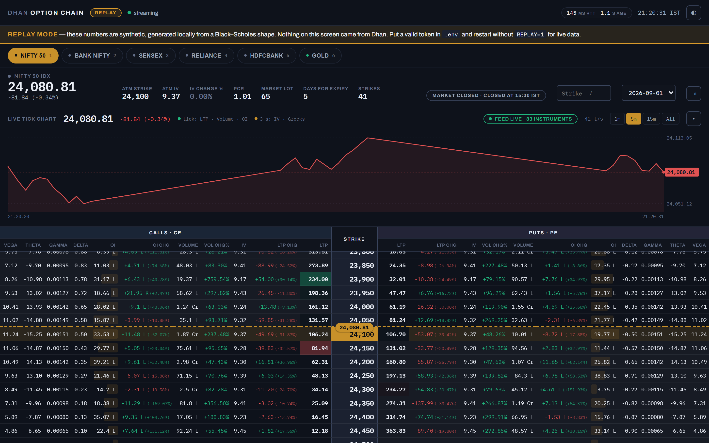

# Dhan Option Chain Terminal

Read-only option chain for six underlyings — every strike, CE and PE, with OI, volume, IV and all
four greeks — next to a panel that shows exactly when each request left for Dhan, when the
response came back, and where the milliseconds went.

Places no orders. Gives no advice.



---

## Quick start

```bash
git clone https://github.com/Dev-Shivam-05/Trading-Dhan-PR.git
cd Trading-Dhan-PR
npm install
```

You need **Node 22.6 or newer** (`node --version`). There is no build step — Node runs the
TypeScript directly and the UI is plain ES modules.

### See it working right now, without a Dhan account

```bash
# Windows PowerShell
$env:REPLAY='1'; npm run dev

# macOS / Linux / Git Bash
REPLAY=1 npm run dev
```

Open <http://127.0.0.1:8787>.

The screen carries a yellow banner: the numbers are generated locally from a Black–Scholes shape,
nothing came from Dhan. Use it to look at the interface, never to read a market.

### Live data

**You need exactly one thing: an access token.** Not the API key, not the secret.

1. Go to **<https://web.dhan.co>** → *My Profile* → **DhanHQ Trading APIs**
   (first time only: click *Request Access*, refresh, then the generate button appears)
2. Generate an **Access Token** and copy it
3. Paste it into `.env`:

```ini
DHAN_CLIENT_ID=<your 10-digit Dhan client id>
DHAN_ACCESS_TOKEN=<paste the JWT from Dhan Web>
```

4. Confirm it works before starting anything:

```bash
npm run check
```

```
  client id  11035xxxxx
  type       SELF
  expires    20/8/2026, 4:29:26 pm  (18.0 h left)

  profile        ... ok  212 ms  Shivam
  option chain   ... ok  198 ms  8 NIFTY expiries, nearest 2026-08-25

  READY. Run `npm run dev` and open http://127.0.0.1:8787
```

5. `npm run dev`

That is the whole switch — no `REPLAY` variable means live mode. The badge in the top bar turns
from `REPLAY` to `LIVE`, the yellow banner disappears, and the GOLD underlying resolves itself
at boot.

#### What each credential is actually for

| Thing | Needed here? | What it is |
|---|---|---|
| **Access token** | **Yes — this is the only one** | A 24-hour JWT. Every REST call sends it as the `access-token` header. |
| Client id | Comes free | It is encoded inside the token as `dhanClientId`. `.env` keeps it so the app can send the `client-id` header without decoding the JWT. |
| API key + secret | No | An *alternative* login route: generate consent → browser login with 2FA → exchange for a token. Useful for building an app other people log into. Pointless when you can just copy your own token. |

A **DhanHQ Data API subscription** (₹499 + tax per month) is required — the option chain, market
quotes and live feed all sit behind it.

#### Token lifetime — the thing that bites

A self-generated token lasts **24 hours**, and Dhan's own docs say generating a new one
*"expires your current token"*. So:

- Generating a fresh token **kills the previous one immediately**, even if hours remain on it.
- Revoking API access kills it too.
- After roughly a day you will need a new one regardless. `npm run check` tells you in one line.

If the screen or `npm run check` reports a rejected token, generate a new one and paste it in.
There is nothing else to fix.

#### Error codes

| Code | Meaning | Fix |
|---|---|---|
| `808` | Client id or token invalid | Token revoked, expired, or replaced by a newer one. Generate a fresh one. |
| `810` | Client id invalid | Check `DHAN_CLIENT_ID`. |
| `DH-901` / `DH-906` | Token invalid or expired | Same as 808. |
| `DH-904` | Rate limited | Nothing to do — the app backs off 3 → 6 → 12 → 30 s by itself. |
| `DH-905` | Bad request, or this IP is not whitelisted | If you whitelisted static IPs in Dhan, add this machine's IP. |
| `806` / `DH-907` | Data APIs not subscribed | The Data API plan is not active. `/v2/profile` reports `dataPlan: Deactive`. Subscribe at web.dhan.co → My Profile → DhanHQ Trading APIs → Data APIs. The option chain, quotes **and the live tick feed** all sit behind it. |

Restart the server after editing `.env` — Node reads it once at startup.

---

## Commands

| Command | What it does |
|---|---|
| `npm run dev` | Backend + UI on <http://127.0.0.1:8787> |
| `REPLAY=1 npm run dev` | Same, with synthetic data and no Dhan account |
| `npm run check` | Validate the token in `.env` against Dhan and print a verdict |
| `npm run typecheck` | `tsc --noEmit` |
| `npm run master:refresh` | Force a fresh download of Dhan's instrument master |
| `npm run feed:probe` | Dump raw feed bytes beside the parsed values, to verify the binary parser |
| `npm run spike:gold` | Diagnose the GOLD underlying by hand (boot does it automatically) |
| `npm run shots` | Screenshot every UI state into `docs/shots/` (server must already be running) |

Change the port with `PORT=9000 npm run dev`.

## Keyboard

`1`–`6` switch instrument · `/` search a strike · `Home` jump to the ATM row ·
`C` collapse the tick chart · `L` toggle the latency panel · `T` toggle theme ·
`E` focus the expiry select

---

## What is on the screen

**The chain.** 23 columns mirroring Dhan's own layout: eleven CE columns, the strike, eleven PE
columns. The strike is rendered as a spine — its own background, heavier borders, larger type — so
it reads first. On load the grid centres itself on the at-the-money row. A dashed line with a price
pill sits between the two strikes that bracket spot, in-the-money sides carry a tint, OI cells
carry an intensity bar, and a cell whose price moved flashes for 400 ms.

**The tick chart.** A strip above the chain, plotting the underlying tick by tick over the Dhan
WebSocket feed — every print is a point, nothing is averaged into candles. Window buttons for
1m / 5m / 15m / all, drag the bottom edge to resize, `C` to collapse. When the feed goes quiet the
line **breaks** rather than drawing a straight line through the gap, because a quiet period is
missing data, not a smooth move.

**The header.** Spot with change, ATM strike, ATM IV, IV change %, PCR, market lot, days to
expiry, strike count. Lot sizes come from Dhan's instrument master on every boot, never from a
constant in code.

**The latency panel.** Eight timestamps per call. Headline is the round trip; beside it the age of
what you are looking at and a countdown to the next poll. Then a stage waterfall (server,
download, compute, transport, render), a 60-call sparkline with p50 and p95 lines, p50/p90/p99/max,
a 20-row call log, and CSV export of the whole 500-sample buffer. Press `L` to hide it — the round
trip and age stay in the top bar.

---

## Three things worth knowing before you trust the numbers

**Two clocks run at once, and the screen says which is which.** The WebSocket feed carries LTP,
volume and OI only — it has no implied volatility and no greeks, at all. Those come from the option
chain REST endpoint, which Dhan rate limits to one request every 3 s per (underlying, expiry). So:

| Column | Source | Freshness |
|---|---|---|
| LTP, Volume, OI (both sides) | WebSocket feed | tick by tick |
| IV, Delta, Gamma, Theta, Vega | Option chain REST | every 3 s |
| ATM IV, PCR, spot change | derived from the 3 s snapshot | every 3 s |

The legend above the chart states this, the feed pill shows how many instruments are subscribed and
the tick rate, and the latency panel keeps its own 3 s countdown. Nothing is blended into a single
misleading "live".

**Nothing on Dhan trades 24×7.** MCX GOLD is the longest session available: 09:00–23:30 IST Monday
to Friday, 23:55 outside US daylight saving, closed on weekends. Outside its window a chip shows
`MARKET CLOSED` with the last snapshot rather than pretending to be live.

**IV Change % is an approximation.** Dhan returns no previous IV, so it is measured against the
first successful snapshot of the session, persisted per day. Hover the number to see the baseline
time. Every other value is either straight from Dhan or arithmetic on Dhan's own fields.

---

## Where things live

```
src/server/
  master.ts        streaming download, cache and parse of Dhan's instrument master
  instruments.ts   the six-instrument registry, id assertions, session windows, GOLD resolver
  dhan.ts          timed REST client, 3 s-per-key rate gate, DH-9xx and 8xx error mapping
  derive.ts        everything Dhan does not return: LTP/OI/volume change, ATM IV, PCR
  poller.ts        one poller per key, telemetry ring buffer, IV baseline store
  feed.ts          Dhan WebSocket live feed: binary packet parser, subscriptions, reconnect
  replay.ts        synthetic chains and ticks, only under REPLAY=1, loudly labelled
  index.ts         REST + SSE + serves the UI
public/
  index.html  app.css  app.js      the whole UI: no framework, no bundler
scripts/
  spike-gold.ts    manual GOLD diagnosis
  shots.ts         screenshot every state
docs/
  PRD.md  prd.html  PHASES.md  spec/  shots/
```

### If you want to change something

| Want to change | Edit |
|---|---|
| Which instruments appear | `REGISTRY` in `src/server/instruments.ts` |
| Refresh cadence | `CADENCE_MS` in `src/server/dhan.ts` (3000 is Dhan's floor — going lower earns `DH-904`) |
| Rate-limit backoff | `BACKOFF_MS` in `src/server/poller.ts` |
| Stale thresholds (6 s amber, 15 s red) | the tick loop near the bottom of `public/app.js` |
| Colours, spacing, type | the token block at the top of `public/app.css` |
| Column order or widths | `CE_COLS` in `public/app.js` and the `<thead>` in `public/index.html` |
| Session windows | `sessionState()` in `src/server/instruments.ts` |
| Tick batching rate (10 Hz) | the `flush` interval in the SSE handler, `src/server/index.ts` |
| Chart gap threshold (5 s) | `GAP_MS` in `drawChart()`, `public/app.js` |

Full spec and acceptance criteria: [docs/spec/option-chain-v1.md](docs/spec/option-chain-v1.md)
and [docs/PRD.md](docs/PRD.md). A visual walkthrough: open [docs/prd.html](docs/prd.html) in a
browser.

## Security

`.env` is git-ignored and read only by the Node process. The access token never reaches the
browser — the UI talks to `127.0.0.1:8787` and nothing else. If you ever paste a token somewhere
public, revoke it in Dhan Web.
